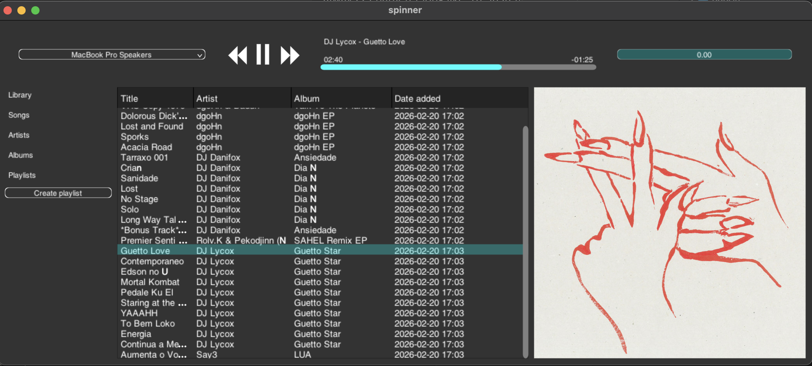

# weave-ui 

weave is a declarative UI library for C++, inspired by the likes of ImGUI, SwiftUI, and xilem.

Its goal is to provide a terse, declarative API (like ImGUI) for designing user interfaces, 
while offering the extensibility of traditional UI libraries.



## Hello world

```cpp
#include <weave/weave.hpp>
#include <format>

struct State {
  int value = 0;
};

auto make_view(State& state) {
  using namespace weave::views;
  return vstack{
    text{std::format("counter value : {}", state.value)},
    button{"Increment", [] (auto& s) { ++s.value; }}
  };
}

int main() {
  State state;
  weave::make_app(state, &make_view).run();
}
```

The views are the high level description of the user interface. Roughly every time an user 
action is triggered, the view constructor (`make_view`) is run and compared against the old 
version to provide updates.

Note that the button above does not take a callback containing a reference : the user 
state is passed down to views and widgets. One of the design goal of `weave` is to 
reduce as much as possible the need to store references. 

## The widgets API 

weave avoid cumbersome inheritance hierarchies to favor non-intrusive polymorphism 
and templates. The `widget_ref` and `widget_box` types encapsulate any types deriving 
from the `widget_base` class, which contains only its position and size. 

```cpp 
struct button : widget_base {
  
  void on(mouse_event e, event_context& ec) {
    if (e.is_enter())
      hovered = true;
    else if (e.is_exit())
      hovered = false;
    else if (e.is_down())
      action(ec);
  }
  
  void paint(painter& p) {
    p.stroke_style(colors::white);
    p.stroke( rounded_rectangle{size(), 3}, 1 );
    p.text_align( text_align::left, text_align::center );
    p.text_bounded(text, size());
  }
  
  std::string text;
  widget_action<void()> action;
  bool hovered = false;
};
```

### The widget tree

Some widgets have children. The only thing that a widget needs to do in order 
to make its children available to the tree traversal is to declare a function 
named `traverse_children` :

```cpp
struct MyWidget {
  
  vec2f layout() { ... place the children... }
  
  auto traverse_children(auto fn) {
    return weave::traverse(fn, a, b, fields);
    // equiavelent to : 
    // return fn(a) && (s ? fn(s) : true) && std::all_of(fields.begin(), fields.end(), /*ect*/);
  }
  
  button b; 
  std::optional<slider> s;
  std::vector<unique_ptr<numeric_field>> fields;
};
```

If a parent wishes to hide a child and disable its interaction logic, it can simply 
exclude the child from traversal, as is implicitly done above with the use of `optional`.

For the moment, we requires that widgets who can be the subject of mouse or keyboard 
focus have a stable memory address while they or their children 
are under focused. This is why we're using `unique_ptr` in the example 
above. It could turns out that a `rebuild` triggered by an interaction from a field 
invalidate the reference held by weave for dispatching mouse events, or maybe we know 
that a change from a field cannot change the quantity from which the fields are instantiated, 
so that unique address might not be needed.

## State mutation 

A lot of views (sliders, fields, knobs...) are both state displayer and mutator. 
These views always need to be passed two things : a value to read, and an invokable 
to write. In weave this pair is called a `read_write`. 
In some cases, those two things can be passed at once, for example 
by passing a pointer to member or any invokable returning a reference : 

```cpp
auto make_app(State& s) {
  auto s  = views::slider{ &State::x }; 
  auto s2 = views::slider{ [] (State& s) -> auto& { return s.x; } };
  auto s3 = views::slider{ read_write{&State::get_x, &State::set_x} };
}
```