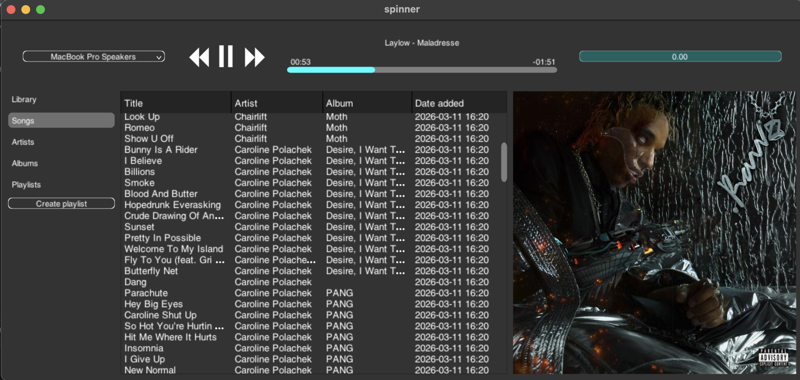
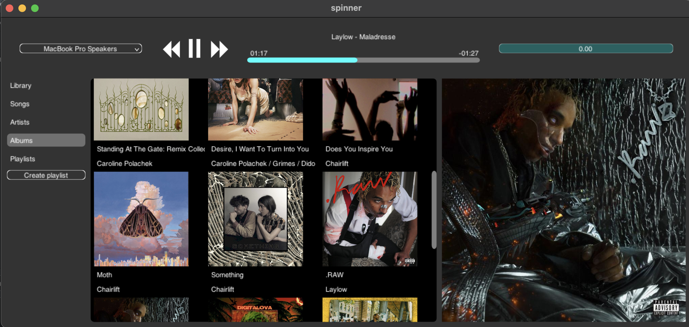

# weave-ui 

weave is a declarative UI library for C++, inspired by the likes of ImGUI, SwiftUI, and xilem.

Its goal is to provide a terse, declarative API for designing user interfaces, 
while offering the extensibility of traditional UI libraries.




*Screenshots of the music player*

## Hello world

```cpp
#include <weave/weave.hpp>

struct State {
  int value = 0;
};

auto make_view(State& state) {
  using namespace weave::views;
  return vstack{
    text{"counter value : {}", state.value},
    button{"Increment", [] (auto& s) { ++s.value; }}
  };
}

int main() {
  State state;
  weave::make_app(state, &make_view).run();
}
```

The `views` are the high level description of the user interface. Roughly every time an user 
action is triggered, the view constructor (`make_view`) is run and compared against the old 
version to provide updates to the underlying widgets. 

Note that the button above does not take a callback containing a reference : the user 
state is passed down to views and widgets. One of the design goal of `weave` is to 
reduce as much as possible the need to store references. 

## The widgets API 

weave avoid cumbersome inheritance hierarchies to favor non-intrusive polymorphism 
and templates. The `widget_ref` and `widget_box` types encapsulate any types deriving 
from the `widget_base` class, which contains only its identifier, position and size. 

```cpp 
struct button : widget_base {
  
  void on(mouse_event e, event_context& ec) {
    if (e.is_enter())
      hovered = true;
    else if (e.is_exit())
      hovered = false;
    else if (e.is_down())
      action(ec);
  }
  
  void paint(painter& p) {
    p.stroke_style(colors::white);
    p.stroke( rounded_rectangle{size(), 3}, 1 );
    p.text_align( text_align::left, text_align::center );
    p.text_bounded(text, size());
  }
  
  std::string text;
  widget_action<void()> action;
  bool hovered = false;
};
```

## The widget tree

Widgets refer to each other using a `widget_id` (a simple integer). The widget tree associate 
each `widget_id` to a reference (which can be relocated) and to the identifier of its parent. 
The children of a widget, however, are not stored in the widget tree, but in the widget themselves.

This architecture was chosen as it makes writing memory safe and efficient code easy : 
since references are never stored outside of the tree and you can test whether 
a `widget_id` is valid or not, this gives you total control over memory layout 
(unlike traditional UI library where everything has to be allocated on the heap)
and references are guaranteed to be valid as long as your code follow some simple rules.

The only thing that a widget needs to do in order to make its children available to the tree 
traversal is to declare a function named `traverse_children` :

```cpp
struct MyWidget : widget_base {
  
  auto traverse_children(auto&& fn) {
    return weave::traverse(fn, a, b, fields);
    // equiavelent to : 
    // return fn(a) && (s ? fn(s) : true) && std::all_of(fields.begin(), fields.end(), /*ect*/);
  }
  
  toggle_button b; 
  std::optional<slider> s;
  std::vector<text_field> fields;
};
```

If a parent wishes to hide a child and disable its interaction logic, it can simply 
exclude the child from traversal, as is implicitly done above with the use of `optional`.

## State mutation 

As said earlier, one of the design goal of `weave` is to not store pointers directly 
anywhere in the library. Most traditional UI libraries force you to keep pointers to your 
state within the widget callback. This is constraining, wasteful, and prevent value 
semantics (you might want to clone some part of your UI and have it operate on a different part of the state).
Therefore, in weave, state is always passed down to widgets, and widgets only have to store 
relative references, preserving value semantics and allowing you to relocate your state as 
needed.

Example : 

```cpp
auto s  = views::slider{ &State::x }; 
auto s2 = views::slider{ [] (State& s) -> auto& { return s.x; } };
auto s3 = views::slider{ &State::set_x, state.x };
```

The state is passed down to widgets by `event_context`. Widgets actions can either operate 
on the concrete state or on `event_context` (should you, for example, want to close an overlay 
on the click of a button).

## Roadmap (in terms of priorities)

- [ ] Code a fully fledged music player and library manager (30% there)

- [ ] Practical system (maybe CSS inspired) to hierarchically customise the look of widgets

- [ ] Audio plugins support 

- [ ] Richer rendering API (maybe transitioning from nanovg towards some Rust library)

- [ ] Accessibility support
